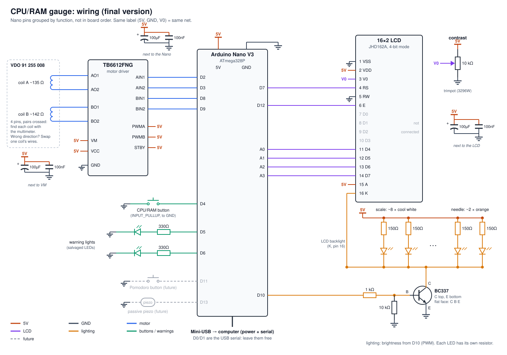

# CPU/RAM gauge

A needle gauge salvaged from a car instrument cluster that shows your computer's
CPU or RAM usage. A Python script reads the system stats and sends them over
serial to an Arduino, which drives the needle's stepper motor and a 16×2 LCD.

- **Needle:** CPU or RAM usage. A button toggles between them.
- **LCD:** the other metric and the app using the most of it, uptime and
  network speed (download or upload, whichever is faster).
- Parks the needle at 0% and turns the LCD off when the computer's screen
  sleeps or the script stops.
- **Clock (optional DS3231 module):** with no data the needle shows the
  minutes and the LCD the time and date; the script keeps it set.

## Hardware

- VDO/Siemens **91 255 008** instrument-cluster stepper motor
- Arduino Uno or Nano (ATmega328P)
- 16×2 HD44780 LCD (4-bit mode) and a 10 kΩ contrast trimpot
- Push button
- Recommended: TB6612FNG motor driver. Wiring the motor straight to the Arduino
  pins is only for bench tests.

| Pin | Function |
|---|---|
| D2, D3 | motor, coil A |
| D8, D9 | motor, coil B |
| D4 | CPU/RAM button, to ground |
| D7, D12 | LCD RS, E |
| A0–A3 | LCD D4–D7 |
| D10 | LCD backlight / lighting (PWM) |



The full pin map, wiring, current budget and bill of materials are in
[NOTES.md](NOTES.md).

## Layout

| Path | Contents |
|---|---|
| `firmware/gauge/` | Final Arduino sketch |
| `firmware/step_counter/` | Bench sketch to drive the motor from the Serial Monitor (19200 baud) and calibrate it |
| `pc/gauge.py` | PC script that sends the readings and LCD text |
| `docs/wiring.svg` | Wiring diagram (generated by `docs/wiring.py`) |
| `docs/perfboard.svg` | Perfboard layout (generated by `docs/perfboard.py`) |
| `NOTES.md` | Design notes, bench results, serial protocol, electronics and to-do list |

## Usage

1. Upload `firmware/gauge/gauge.ino` to the Arduino (needs the `LiquidCrystal`
   library, bundled with the Arduino IDE).
2. Install the PC dependencies and run the script:

   ```sh
   pip install -r pc/requirements.txt
   python3 pc/gauge.py            # auto-detects the Arduino
   python3 pc/gauge.py --port /dev/cu.usbmodem101 -v
   ```

The script runs on macOS and Linux. It also runs on Windows, but can't detect
when the screen is asleep.

### Button

- **Short press:** toggle the needle between CPU and RAM.
- **Hold 1 s:** 0 → 100 → 0 sweep (self-test).
- **Hold while powering up:** force a full homing against the end stop.

## Calibration

The motor has no public datasheet, so its parameters were measured on the bench
with `step_counter`: 290 half-steps between end stops, and `HOME_PHASE = 6`.
**Recalibrate `HOME_PHASE` if the motor wiring changes.** [NOTES.md](NOTES.md)
has the procedure.

**Never turn the needle shaft by hand:** it damages the motor's internal
gearbox.

## Notes

[NOTES.md](NOTES.md) records how the project got here: how the motor was
identified, bench measurements, design decisions, the serial protocol, EEPROM
layout and what's left to do.
